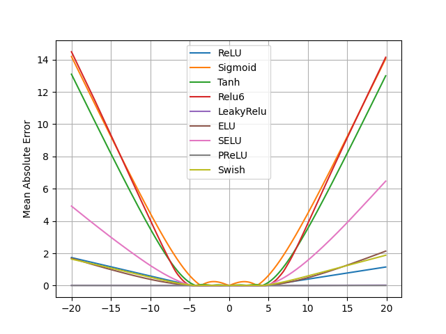

# NALU2IM
Neural Arithmetic Logic Units with Two Transition Matrix and Independent Gates

An implementation of Neural Arithmetic Logic Units (https://arxiv.org/pdf/1808.00508.pdf)

## Exp 1: Fail to Extrapolate
Train an identity mapping on [-5, 5] and test it on [-20, 20]

```bash
python3 failure.py
```

#### Results

* Most non linear activation functions fail to exprapolate except that PReLU can learn to be highly linear.



## Exp 2: Static Simple Function Learning
Input a 100-dimensional vertex **x**, learn `y = func(a, b)`,
where 
,   and `func = +, -, x, /, ...`. Test the ability to interpolate and extrapolate.

```bash
python3 learn_function.py
```
### Interpolation
* RMSE (normalized to a random baseline)

|     |ReLU|Sigmoid|NAC|NALU|NALU2M|NALUIG|NALU2MIG|
| --- |  --- | --- | --- | --- | --- | --- | --- |
|a + b|0.00|0.12|0.00|0.33|0.10|0.00|0.02|
|a - b|0.27|0.37|0.00|9.88|0.00|90.44|0.13|
|a x b|1.84|1.20|13.71|0.91|0.36|6.87|0.00|
|a / b|0.67|0.14|1.75|0.21|0.06|0.05|0.01|
|a ^ 2|4.02|0.43|21.79|1.31|0.17|7.42|0.00|
|sqrt(a)|0.80|0.07|2.95|0.05|0.04|0.01|0.01|

### Extrapolation
* RMSE (normalized to a random baseline)

|     |ReLU|Sigmoid|NAC|NALU|NALU2M|NALUIG|NALU2MIG|
| --- |  --- | --- | --- | --- | --- | --- | --- |
|a + b|0.00|62.47|0.00|85.86|44.93|0.02|0.44|
|a - b|55.18|55.74|0.00|80.15|0.00|90.54|0.39|
|a x b|57.51|88.54|76.09|99.89|98.28|85.50|0.00|
|a / b|2.73|1.15|20.77|3.35|1.03|16.82|0.11|
|a ^ 2|58.25|82.84|77.55|98.61|76.69|88.29|0.00|
|sqrt(a)|18.32|19.57|65.64|45.42|21.23|4.60|0.19|


## Conclusion

Our experiments show that NALU-enhanced
neural networks i.e., NALU2M, NALUIG and
NALU2MIG, can be useful in overcoming the
issues faced by traditional neural networks. The
NALU2MIG have a error rate lower then the state
of art witch make it clear that it do a accurate
generalization, numerical representations and numerical functions outside the range observed during
training. The experiments show that, as compared
to other traditional neural network activation functions, our models allow arbitrary numerical functions to be added to the module and controlled via
independent learned gates and matrices.


See [nalu.py](nalu.py) for more details. I found these modifications can help the performance on the static simple function learning task.

